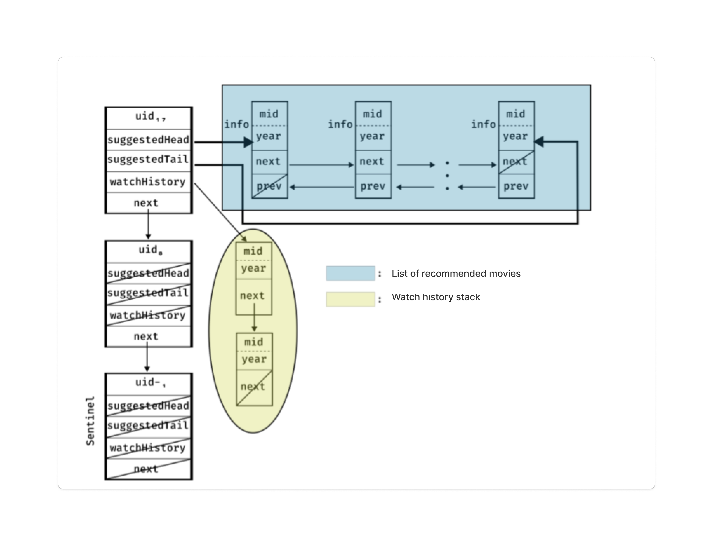
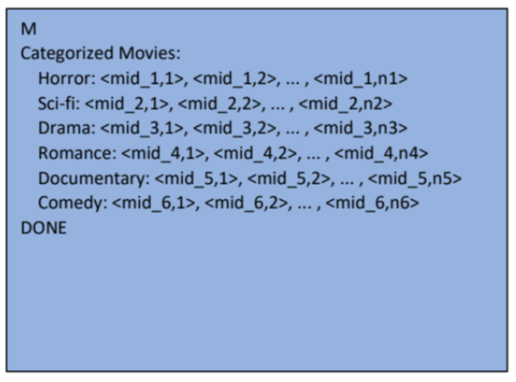

# Data Structures Part A

## General Description
The aim of this project is to simulate a streaming service. The service offers movies organized into different thematic categories. Users can register on the platform, watch movies 
and add them to their watch history, receive movie recommendations based on the watch history of other users, and perform filtered searches across movie categories.

## Detailed Description of the Implementation

The service you will implement organizes its available movies into six thematic categories: Horror, Science Fiction, Drama, Romance, Documentary, and Comedy. Each movie belongs to only one 
category and has a unique identifier. The categorization of movies will be implemented using a six-position array, called the category array. Each position in the array contains a pointer 
(of type ```struct movie *```) pointing to the first element of the linked list of movies for that particular category. This list is a singly linked list, sorted in ascending order based on the 
movie identifier (```mid```). A node in this list represents a movie within the category, defined by a structure (```struct movie```) with the following fields:

- **info:** A helper structure of type ```struct movie_info``` that describes the available information for a movie. Its fields are as follows:
   - **mid:** A unique identifier for the movie, of type ```unsigned int```.
   - **year:** The release year of the movie, of type ```unsigned int```.
- **next:** A pointer (of type ```struct movie```) that points to the next element in the movie list for the category.

Before being added to the appropriate list in the category array, new movies added to the service are first inserted into a separate list, the **new releases list**. This list contains 
movies from different categories, is a **singly linked list**, and is **sorted** in **ascending order** based on the movie identifier, just like the lists in the category array. The nodes 
in this list are implemented using the ```struct new_movie``` structure, which has the following fields:

- **info:** Information about the movie, of type ```struct movie_info```, as in ```struct movie```.
- **category:** The category to which this movie belongs, represented as an enum of type ```movieCategory_t```.
- **next:** A pointer (of type ```struct new_movie```) that points to the next node in the new releases list.

Figure 1 shows the category array in a hypothetical execution of the program. It is a fixed-size array with 6 positions, each containing a list of movies.


The sentinel node of the user list is a node used for the correct management of the list (and is therefore an auxiliary node). It is of type ```struct user```, but its ```uid``` is set to 
-1. The pointers ```suggestedHead```, ```suggestedTail```, ```watchHistory```, and ```next``` for each user are initially set to ```NULL```. The possible structure of the user list in a 
hypothetical program execution is shown in Figure 2.




To implement the doubly linked list of recommended movies for the user, we use the ```struct suggested_movie``` structure, which has the following fields:
- **info:** A field of type ```struct movie_info```, which contains information about the movie.
- **prev:** A pointer of type ```struct suggested_movie```, which points to the previous element in the recommended movies list.
- **next:** A pointer of type ```struct suggested_movie```, which points to the next element in the recommended movies list.

# Program Operation
The program you will implement should be executed with the following command: 
```<executable> <input file>```
where ```<executable>``` is the name of the executable (e.g., ```cs240StreamingService```) and ```<input file>``` is the name of an input file (e.g., testFile) a file that contains one event per line. The events need to be implemented in your program and follow one of the following formats:

## Event R (R `<uid>`)

A **Register User** event, in which a new user with identifier ```uid``` registers in the service. We first need to traverse the user list to check that there is no existing user with 
the identifier ```uid``` in the service. We then implement an insertion algorithm to add the new user to the user list. Our algorithm has a time complexity of O(1). The fields 
```suggestedHead```, ```suggestedTail```, and ```watchHistory``` for the new user are initialized to ```NULL```. After executing this event, the program prints the following information:


where `n` is the number of nodes in the user list, and for each i ∈ {1, …, n}, `<uid_i>` is the identifier of the user corresponding to the i-th node in the list.

## Event U (U `<uid>`)

An **Unregister User** event, in which the user with identifier <uid> leaves the service. We first need to clear the user’s doubly linked list of recommended movies and their watch history 
stack by removing all their elements (if they exist) before removing the user from the list. After executing such an event, the program prints the following information:


where `n` is the number of nodes in the user list, and for each i ∈ {1, …, n}, `<uid_i>` is the identifier of the user corresponding to the i-th node in the list.

## Event A (A `<mid> <category> <year>`)

An **Add New Movie** event, in which a movie with identifier `<mid>`, category `<category>`, and release year `<year>` is added to the service. We insert the movie into the sorted 
new releases list, not the category array list. The new releases list should remain sorted (in ascending order based on the movie identifier) after each insertion. After executing this 
event, the program prints the following information:


where `n` is the number of elements in the new releases list, and `mid_i`, `category_i`, `year_i`,i ∈ {1, …, n}, represent the identifier, category, and release year of the movie corresponding to the \( i \)-th node in the new releases list.


## Event D

A **Distribute New Movies** event, in which the movies from the new releases list are assigned to the lists in the category array based on their category. This event is implemented in 
time complexity of \( O(n) \), where `n` is the size of the new releases list. We need to traverse the new releases list once, removing each movie encountered and adding it to the 
appropriate list in the category array. By the end of this process, the new releases list should be empty, and the lists in the category array should be sorted in ascending order based on 
the movie identifier. After executing this event, the program prints the following information:


where `n1`, `n2`, …, `n6` are the sizes of the six category lists, and `<mid_i,j>` is the identifier of the movie corresponding to the \( j \)-th node in the movie list for category \( i \).


## Event W (W `<uid> <mid>`)

A **User Watches Movie** event, in which the user with identifier `<uid>` watches the movie with identifier `<mid>`. First, we locate the movie information (`struct movie_info`) 
by searching through the lists in the category array, as well as locate the user by searching the user list. Next, we create a new `struct movie` and push it onto the user’s watch history 
stack. After executing this event, the program prints the following information:


where `n` is the number of elements in the watch history stack of the user `<uid>`, and `mid_i`, i ∈ {1, …, n}, is the identifier of the movie corresponding to the \( i \)-th 
element in the stack.

## Event S (S `<uid>`)

A **Suggest Movies to User** event, in which the user with identifier `<uid>` receives movie suggestions from the service based on the watch history of other users. For each user in the user list — except for the user `<uid>` — we remove one movie from the top of their watch history stack (if it exists) and add it to the doubly linked list of recommended movies for the user `<uid>`. 

These additions should alternate between the start and the end of the list, as described below:
- The first item is inserted as the first element, with the `suggestedHead` pointer pointing to it.
- The second item is inserted as the last element, with the `suggestedTail` pointer pointing to it.
- The \( (2i+1) \)-th item, \( i > 0 \), is inserted after the \( (2i-1) \)-th item, while the \( (2i) \)-th item, \( i > 1 \), is inserted before the \( (2i-2) \)-th item.

Thus, the third item is added after the first, the fourth item before the second, and so on.
This process is executed with a time complexity of \( O(n) \), where `n` is the number of users in the application. After executing this event, the program prints the following 
information:


where `n` is the number of elements in the recommended movies list for the user `<uid>`, and `mid_i`, i ∈ {1, …, n}, is the identifier of the movie corresponding to the \( i \)-
th node in the recommended movies list.

## Event F (F `<uid> <category1> <category2> <year>`)

A **Filtered Movie Search** event, in which the user `<uid>` requests that the service recommend movies belonging to either of two categories, `<category1>` or `<category2>`, and with a 
release year greater than or equal to `<year>`. We traverse the movie lists for both categories in the category array, identify movies with the appropriate release year, and merge 
them into a new doubly linked list. 

This list is sorted in ascending order by movie identifier, like the category lists, and appended to the end of the user's existing recommended movies list (if it is not empty). If 
the user’s recommended movies list is empty, it will be replaced by the new list. We do not remove items from the two category lists; instead, for each matching movie, we create a new 
node in the user's recommended movies list. This process is executed with a time complexity of \( O(n + m) \), where `n` and `m` are the number of elements in the two category lists being 
traversed, respectively. After executing this event, the program should print the following information:


where `n` is the number of elements in the recommended movies list for the user `<uid>`, and `mid_i`, i ∈ {1, …, n}, is the identifier of the movie corresponding to the \( i \)-
th node in the recommended movies list.

## Event T (T `<mid>`)

A **Take Off Movie** event, in which the movie `<mid>` is removed from the service. We need to remove the movie from any user’s recommended movies list in which it may be present, as well 
as from the appropriate category list in the category array. After executing this event, the program prints the following information:


where `n` is the number of users who had the movie `<mid>` in their recommended movies list, `uid_i`, i ∈ {1, …, n}, is the identifier of the \( i \)-th user in the user list 
who had the movie in their recommendations, `<category>` is the category to which the movie belonged, `k` is the new size of the category list to which `<mid>` belonged after its removal, 
and `mid_j`, j ∈ {1, …, k}, is the identifier of the \( j \)-th movie in the category list.

## Event M

A **Print Movies** event, in which the program prints information about all the movies in the lists of the category array. After executing such an event, the program prints 
the following information:



where `n1`, `n2`, …, `n6` are the sizes of the six category lists, and `<mid_i,j>` is the identifier of the movie corresponding to the \( j \)-th node in the \( i \)-th category list.

## Event P

A **Print Users** event, in which the program prints information about each user in the user list. After executing such an event, the program prints the following information:


where `n` is the number of elements in the user list, `s_i` and `w_i`,i ∈ {1, …, n}, are the sizes of the recommended movies list and the watch history stack for the \( i \)-th 
user, respectively. `mid_i,j`, i ∈ {1, …, n},j ∈ {1, …, s_i}, is the identifier of the movie at the \( j \)-th node in the recommended movies list for the \( i \)-
th user, and `mid'_i,j`, i ∈ {1, …, n}, j ∈ {1, …, w_i} \), is the identifier of the movie at the \( j \)-th node in the watch history stack for the \( i \)-th user.

## Running the Code

To compile and run the project, follow these steps:

### Using the Makefile

1. **Open your terminal.**
2. **Navigate to the project directory** where your files are located.
3. **Compile the project** by running the following command:
   ```bash
   make
4. ./cs240StreamingService <input_file>

where <input_file> is the name of your desired input file (e.g., ```./TestFiles/test_U10M30```).


## License
This project is licensed under the MIT License - see the [LICENSE](LICENSE) file for details.


